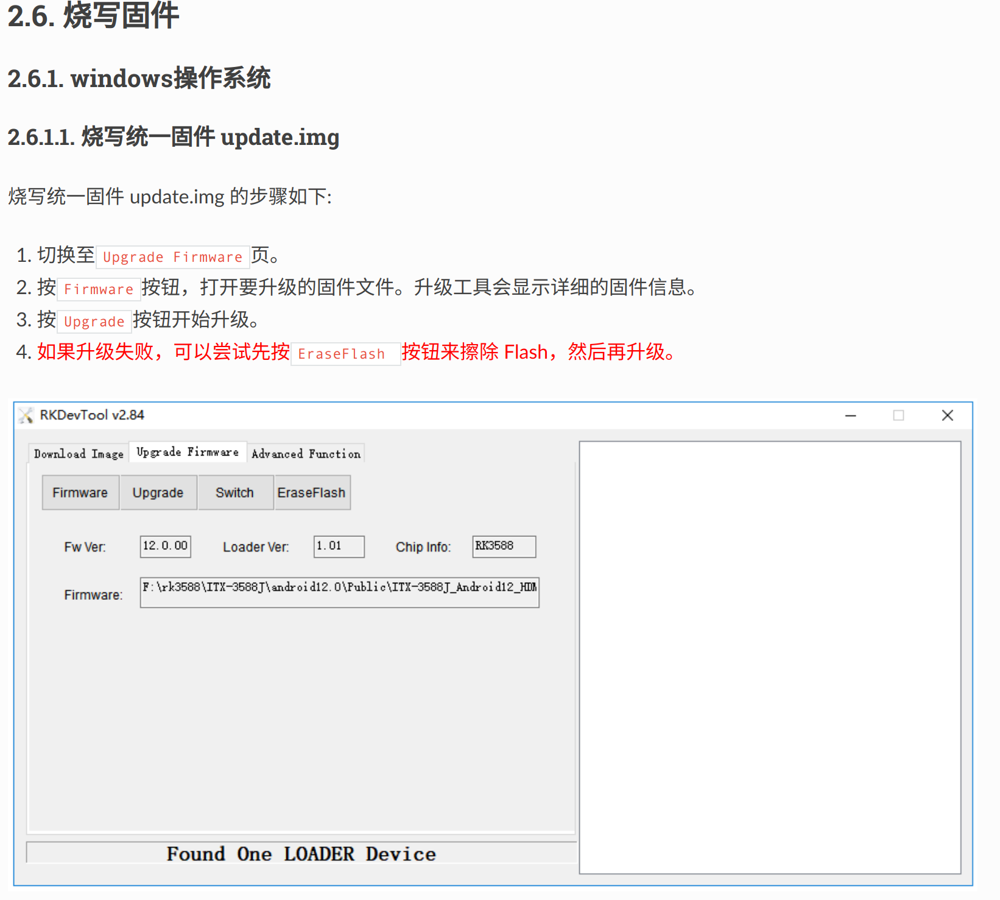

Ren Hangqi (2572131118@qq.com)

Update Time: 2025.4.23
# Operations needed for the new board
If the board is a newly acquired RK3588, it may not have anything written inside, including the bootloader, so you first need to preliminarily write to the board, writing Uboot, Linux, Rootfs, etc. It is recommended to write using [RKDevTool](https://download.t-firefly.com/product/Board/RK3588/Tool/Window/RKDevTool_Release_v3.31.zip) on Windows.

You can directly download the update.img from [this link](https://bhpan.buaa.edu.cn/link/AA6F31C943712347DEB8D04FF1E5975F86). This image packages all the above content. Directly writing this image can achieve everything in one step, the specific operations are as follows:

1. Connect the board to the computer via USB using the Type-C port.
2. First, put the board in MaskRoom or Loader mode (can be recognized in RKDevTool)
   + Loader mode: While powered on, press RST and BOOT buttons simultaneously, or enter ```reboot loader``` in Uboot, Linux.
   + MaskRoom mode: New boards default to this mode.
3. Operate in RKDevTool as shown below



# Obtain RK3588 Kernel Image
RK3588 has a dedicated kernel image, the source code can be obtained through [this link](https://bhpan.buaa.edu.cn/link/AA7E3F2C1C703F48A7A6CE1FF74741753D).

For ease and quick start, this kernel is already compiled, so the file is large. You can directly obtain the image through ```kernel/arch/arm64/boot/Image``` or use the existing ```.config``` to customize the required image.

Of course, if you are not concerned about the kernel source code, you can directly obtain the Image through [this link](https://bhpan.buaa.edu.cn/link/AAAAF1803AEC0F4710BF322C54804F72DC).

# Serial Port Connection

RK3588's serial port is quite special, you need to purchase a USB to TTL converter for connection.


Connect RT-TX, TX-RD, GND-GND when connecting, and the baud rate of the serial port is 1500000 after connecting to the computer.

# Re-write Uboot
To start hvisor, the original Uboot has no waiting time and will directly start Linux. Uboot needs to be rewritten, and a copy of Uboot and its writing tool is already prepared, which can be obtained through [Uboot](https://bhpan.buaa.edu.cn/link/AA6220C0C619A840DEAC44F1F813FC0109), [Upgrade-tool](https://bhpan.buaa.edu.cn/link/AA285131D2DDD14AD79A030AB2A38F4D63).

Under the Linux system, also connect the board and the computer with USB and put it in Loader mode:

```
chmod +777 /path/to/upgrade_tool
sudo upgrade_tool di -u /path/to/uboot.img
```

# Compile Hvisor and Device Tree
1. Similar to other development boards, pull the latest code of hvisor from the repository: https://github.com/syswonder/hvisor. Enter the directory and compile hvisor:
    ```
    make BID=aarch64/rk3588
    ```
2. Enter ```/images/aarch64/devicetree/```, ```rk3588-root-aarch64-sdmmc.dts``` is the device tree used by RK3588 RootLinux, ```rk3588-nonroot-aarch64.dts``` is the device tree used by RK3588 NonRootLinux. You can compile them using the following commands:
    ```
    dtc -I dts -O dtb rk3588-nonroot-aarch64.dts -o ./linux1.dtb
    dtc -I dts -O dtb rk3588-root-aarch64-sdmmc.dts -o ./zone0.dtb
    ```

# Create File System
Prepare an SD card, partition it into two, the first one in FAT32 format, size 1GB; the second one in EXT4 format.

Download the [file system](https://bhpan.buaa.edu.cn/link/AA91FB720EDBF949FA909538CC6093C8D0), unzip this file system to the EXT4 formatted partition.

Of course, you can also make it yourself, refer to [Building a file system based on ubuntu_base](https://foreveryolo.top/posts/60156/).
# Start RootLinux
# TFTP
If a TFTP server is already set up, then you can start RootLinux in a convenient way, specifically:

1. Copy Image, zone0.dtb, hvisor.bin to the ~/tftp folder
2. Connect the host and the development board with an Ethernet cable, configure the host IP to ```192.168.137.2```, subnet mask ```255.255.255.0```.
3. Simply power on and connect the serial port, uboot will automatically download the content from the tftp folder and start.

If you need to set up, you can refer to [Rapid Development on Embedded Platforms - Tftp Server Setup and Configuration](https://foreveryolo.top/posts/17937/).
# Without TFTP
At this time, the first FAT32 partition on the SD card comes into play, copy Image, zone0.dtb, hvisor.bin to this partition

1. Start the development board, connect the serial port.
2. Interrupt Uboot's automatic start.
3. Enter the following commands to start RootLinux
    ```
    fatload mmc 0:1 0x00480000 hvisor.bin;fatload mmc 0:1 0x10000000 zone0.dtb;fatload mmc 0:1 0x09400000 Image;bootm 0x00480000 - 0x10000000
    ``` 
# Start NonRootLinux
# Download Ready-Made Configuration Files
Through [this link](https://bhpan.buaa.edu.cn/link/AAC7FF42BDBBE44ABEBB512459C379BCE4) you can download usable NonRoot configurations, including Image, configuration files, rootfs, etc., unzip them to the RootLinux file system, which can help quickly start Nonroot, mainly starting devices like virtio-blk and virtio-console, or you can pass through devices according to your own needs.

<div class="warning">
    <h1> Tips: </h1>
    <p> Please do not arbitrarily change the Image used for Rootlinux, as this will cause Nonroot to fail to start! </p>
</div>

# Compile hvisor-tool
Pull the latest code of Hvisor-tool: https://github.com/syswonder/hvisor-tool/tree/main, and compile:
```
make all ARCH=aarch64 LOG=LOG_WARN KDIR=RK3588 kernel source VIRTIO_GPU=n
```
For more details, please refer to the Readme.md of hvisor-tool.

Note, the kernel source must have been compiled, otherwise hvisor-tool will report an error because it cannot find the compiled product.

<div class="warning">
    <h1> Tips: </h1>
    <p> The glibc version used when compiling hvisor-tool needs to ensure that the Rootlinux file system also supports it, otherwise hvisor-tool will not work properly! </p>
</div>

For example, the Rootlinux Rootfs given in this article is Ubuntu 24.04. The Glibc version of the compiling machine should not be higher than the Glibc version of Ubuntu24.04, which is generally satisfied here since Ubuntu24.04 is newer.

Of course, the above operation is completed by aligning the glibc versions used by the two file systems, or you can directly compile hvisor-tool in the Rootlinux file system, or specify the Rootlinux file system directory on the compiling machine, so that the compilation link directly links the glibc of the Rootlinux file system, specifically as follows:

```
make all ARCH=aarch64 LOG=LOG_WARN KDIR=RK3588 kernel source VIRTIO_GPU=n \
ROOT=/path/to/target_rootfs
```
# Start
Execute the following commands under Rootlinux
```
insmod hvisor.ko
nohup ./hvisor virtio start virtio_cfg.json &
./hvisor zone start zone1_linux.json
screen /dev/pts/0
```
You can then see the output of the second virtual machine (Nonroot).
<div class="warning">
    <h1> Tips: </h1>
    <p> If you do not configure the Rootlinux file system according to the above process, or with version iterations, there may be situations where the ready-made configuration files are not usable, in which case you need to update the configuration yourself, and we will also follow up as soon as possible.
    <p> For the latest configuration format, you can refer to the example under hvisor-tool.</p>
</div>