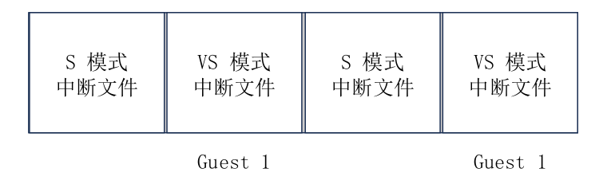
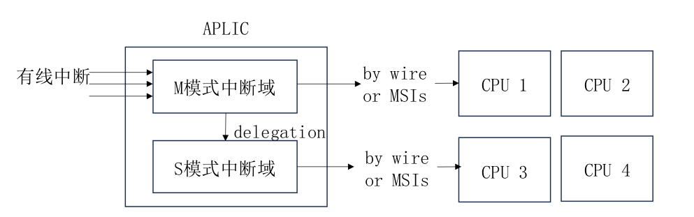
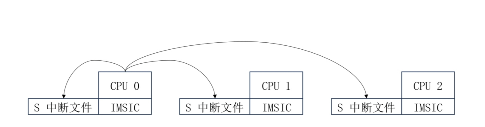

# Overall Structure
AIA mainly includes two parts, the Interrupt Message Controller IMSIC and the Advanced Platform Level Interrupt Controller APLIC, with the overall structure shown in the diagram below.


Peripherals can choose to send message interrupts or send wired interrupts via a connected line.

If peripheral A supports MSI, it only needs to write the specified data into the interrupt file of the designated hart, after which IMSIC will deliver an interrupt to the target processor.

For all devices, they can connect to APLIC via an interrupt line, and APLIC will choose the interrupt delivery mode based on the configuration:
* Wired interrupt
* MSI

In hvisor, the interrupt delivery mode is MSI.

After enabling the AIA specification with `IRQ=aia` in hvisor, the handling of clock interrupts remains consistent, while the handling of software interrupts and external interrupts changes.

# External Interrupts
## IMSIC

In hvisor, a physical CPU corresponds to a virtual CPU, each having their own interrupt file.



Writing to an interrupt file can trigger an external interrupt for a specified hart at a specified privilege level.

Provide a two-stage address mapping table for IMSIC.
```rs
        let paddr = 0x2800_0000 as HostPhysAddr;
        let size = PAGE_SIZE;
        self.gpm.insert(MemoryRegion::new_with_offset_mapper(
            paddr as GuestPhysAddr,
            paddr + PAGE_SIZE * 1,
            size,
            MemFlags::READ | MemFlags::WRITE,
        ))?;
        ...
```

## APLIC
### Structure
There is only one global APLIC.

When a wired interrupt arrives, it first reaches the root interrupt domain in machine mode (OpenSBI), then the interrupt is routed to the sub-interrupt domain (hvisor), and hvisor sends the interrupt signal to the corresponding CPU of the virtual machine in MSI mode according to the target registers configured by APLIC.



The AIA specification manual specifies the byte offsets for various fields of APLIC. Define the APLIC structure as follows, and implement read and write operations for APLIC fields using the following methods:
```rs
#[repr(C)]
pub struct Aplic {
    pub base: usize,
    pub size: usize,
}
impl Aplic {
    pub fn new(base: usize, size: usize) -> Self {
        Self {
            base,
            size,
        }
    }
    pub fn read_domaincfg(&self) -> u32{
        let addr = self.base + APLIC_DOMAINCFG_BASE;
        unsafe { core::ptr::read_volatile(addr as *const u32) }
    }
    pub fn set_domaincfg(&self, bigendian: bool, msimode: bool, enabled: bool){
        ...
        let addr = self.base + APLIC_DOMAINCFG_BASE;
        let src = (enabled << 8) | (msimode << 2) | bigendian;
        unsafe {
            core::ptr::write_volatile(addr as *mut u32, src);
        }
    }
    ...
}
```

### Initialization
Initialize APLIC based on the base address and size in the device tree.
```rs
pub fn primary_init_early(host_fdt: &Fdt) {
    let aplic_info = host_fdt.find_node("/soc/aplic").unwrap();
    init_aplic(
        aplic_info.reg().unwrap().next().unwrap().starting_address as usize,
        aplic_info.reg().unwrap().next().unwrap().size.unwrap(),
    );
}
pub fn init_aplic(aplic_base: usize, aplic_size: usize) {
    let aplic = Aplic::new(aplic_base, aplic_size);
    APLIC.call_once(|| RwLock::new(aplic));
}
pub static APLIC: Once<RwLock<Aplic>> = Once::new();
pub fn host_aplic<'a>() -> &'a RwLock<Aplic> {
    APLIC.get().expect("Uninitialized hypervisor aplic!")
}
```
There is only one global APLIC, so locking is used to avoid read-write conflicts, and the host_aplic() method is used for access.

When the virtual machine starts, the address space of APLIC is initialized, which is unmapped. This triggers a page fault, trapping into hvisor for handling.
```rs
pub fn guest_page_fault_handler(current_cpu: &mut ArchCpu) {
    ...
    if addr >= host_aplic_base && addr < host_aplic_base + host_aplic_size {
        let mut inst: u32 = read_csr!(CSR_HTINST) as u32;
        ...
        if let Some(inst) = inst {
                vaplic_emul_handler(current_cpu, addr, inst);
                current_cpu.sepc += ins_size;
            }
        ...
    }
}
```
Determine if the accessed address space belongs to APLIC, parse the access instruction, and enter vaplic_emul_handler to simulate APLIC in the virtual machine.

```rs
pub fn vaplic_emul_handler(
    current_cpu: &mut ArchCpu,
    addr: GuestPhysAddr,
    inst: Instruction,
) {
    let host_aplic = host_aplic();
    let offset = addr.wrapping_sub(host_aplic.read().base);
    if offset >= APLIC_DOMAINCFG_BASE && offset < APLIC_SOURCECFG_BASE {
        match inst {
            Instruction::Sw(i) => {
                ...
                host_aplic.write().set_domaincfg(bigendian, msimode, enabled);
            }
            Instruction::Lw(i) => {
                let value = host_aplic.read().read_domaincfg();
                current_cpu.x[i.rd() as usize] = value as usize;
            }
            _ => panic!("Unexpected instruction {:?}", inst),
        }
    }
    ...
}
```
## Interrupt Process
After hvisor completes the simulation of APLIC initialization for the virtual machine through a page fault, it enters the virtual machine. Taking the interrupt generated by a keyboard press as an example: the interrupt signal first arrives at OpenSBI, then is routed to hvisor, and based on the configuration of the target register, it writes to the virtual interrupt file to trigger an external interrupt in the virtual machine.

# Software Interrupts
After enabling the AIA specification, the Linux kernel of the virtual machine sends IPIs through MSI, eliminating the need to trap into hvisor using the ecall instruction.



As shown in the diagram, in hvisor, writing to the interrupt file of a specified hart can trigger an IPI.

In the virtual machine, writing to a specified virtual interrupt file can achieve IPIs within the virtual machine, without the need for simulation support from hvisor.