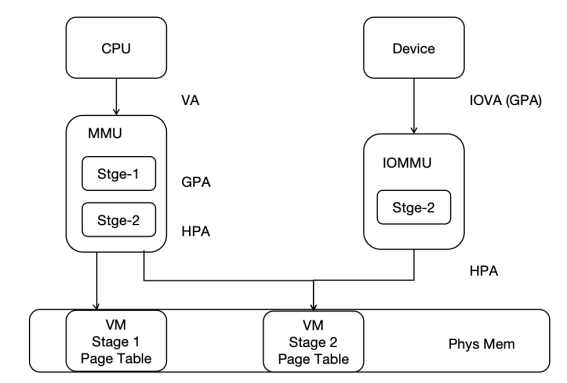
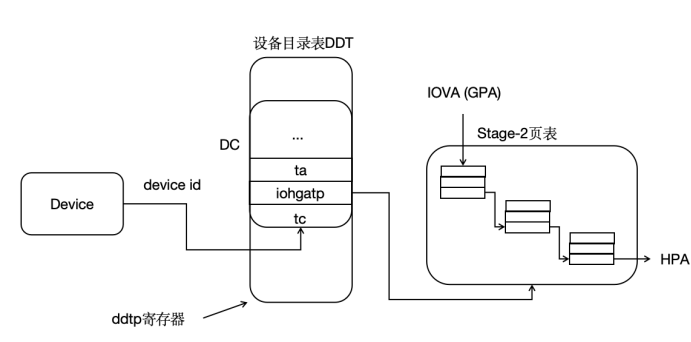

### 4.6.1.2 Implementation of the RISC-V IOMMU Standard

#### RISC-V IOMMU Workflow

For virtualized systems with DMA devices, the system could potentially be compromised by malicious DMA configurations by the virtual machines, affecting the overall system stability. The introduction of IOMMU can further enhance the isolation between Zones to ensure system security.

IOMMU supports two-stage address translation and provides DMA remapping functionality. On one hand, it offers memory protection for DMA operations, limiting the physical memory areas that devices can access, making DMA operations safer. On the other hand, device DMA operations only require contiguous IOVAs, not contiguous PAs, allowing for better utilization of scattered pages in physical memory.

To perform address translation and memory protection, RISC-V IOMMU uses the same page table format as the CPU's MMU in both the first and second stages. Using the same page table format as the CPU MMU simplifies some of the complexities associated with DMA in memory management, and allows the CPU MMU and IOMMU to share the same page tables.

In hvisor, the second-stage address translation process supported by IOMMU is the translation from device-side IOVA (GPA) to HPA, and the second-stage page table is shared between the CPU MMU and IOMMU, as illustrated below:



Before translation, IOMMU needs to find the device context (DC) in the device directory table based on the device identifier (device_id). Each device has a unique device_id; for platform devices, the device_id is specified during hardware implementation, and for PCI/PCIe devices, the BDF number of the PCI/PCIe device is used as the device_id. The DC contains information such as the base address of the two-stage address translation page table and some translation control information. For example, in two-stage address translation, the IO device's IOVA is first translated into GPA in the Stage-1 page table pointed to by the fsc field, then into HPA in the Stage-2 page table pointed to by the iohgatp field, and accesses memory accordingly. In hvisor, only the second-stage translation using the iohgatp field is supported, as shown below:



RISC-V IOMMU, as a physical hardware, can be accessed using the MMIO method, and its various fields' byte offsets are specified in the IOMMU specification manual. Implementation requires access according to the specified offsets and sizes to correctly retrieve the values of each field. The IommuHw structure is defined to simplify access to the physical IOMMU, as follows:

```rust
#[repr(C)]
#[repr(align(0x1000))]
pub struct IommuHw {
    caps: u64,
    fctl: u32,
    __custom1: [u8; 4],
    ddtp: u64,
    cqb: u64,
    cqh: u32,
    cqt: u32,
    fqb: u64,
    fqh: u32,
    fqt: u32,
    pqb: u64,
    pqh: u32,
    pqt: u32,
    cqcsr: u32,
    fqcsr: u32,
    pqcsr: u32,
    ipsr: u32,
    iocntovf: u32,
    iocntinh: u32,
    iohpmcycles: u64,
    iohpmctr: [u64; 31],
    iohpmevt: [u64; 31],
    tr_req_iova: u64,
    tr_req_ctl: u64,
    tr_response: u64,
    __rsv1: [u8; 64],
    __custom2: [u8; 72],
    icvec: u64,
    msi_cfg_tbl: [MsiCfgTbl; 16],
    __rsv2: [u8;3072],
}
```

The Capabilities of the IOMMU is a read-only register, which reports the features supported by the IOMMU. When initializing the IOMMU, it is necessary to first check this register to determine if the hardware can support IOMMU functionality.

When initializing, the IOMMU first checks if the current IOMMU matches the driver. The rv_iommu_check_features function is defined to check for hardware support for Sv39x4, WSI, etc., as implemented below:

```rust
impl IommuHw {
    pub fn rv_iommu_check_features(&self){
        let caps = self.caps as usize;
        let version = caps & RV_IOMMU_CAPS_VERSION_MASK;
        // get version, version 1.0 -> 0x10
        if version != RV_IOMMU_SUPPORTED_VERSION{
            error!("RISC-V IOMMU unsupported version: {}", version);
        }
        // support SV39x4
        if caps & RV_IOMMU_CAPS_SV39X4_BIT == 0 {
            error!("RISC-V IOMMU HW does not support Sv39x4");
        }
        if caps & RV_IOMMU_CAPS_MSI_FLAT_BIT == 0 {
            error!("RISC-V IOMMU HW does not support MSI Address Translation (basic-translate mode)");
        }
        if caps & RV_IOMMU_CAPS_IGS_MASK == 0 {
            error!("RISC-V IOMMU HW does not support WSI generation");
        }
        if caps & RV_IOMMU_CAPS_AMO_HWAD_BIT == 0 {
            error!("RISC-V IOMMU HW AMO HWAD unsupport");
        }
    }
}
```

The fctl of the IOMMU is a functional control register, which provides some functional controls of the IOMMU, including whether the IOMMU accesses memory data in big-endian or little-endian, whether the interrupt generated by the IOMMU is a WSI interrupt or an MSI interrupt, and the control of the guest address translation scheme.

The ddtp of the IOMMU is the device directory table pointer register, which contains the PPN of the root page of the device directory table, as well as the IOMMU Mode, which can be configured as Off, Bare, 1LVL, 2LVL, or 3LVL. Off means that the IOMMU does not allow devices to access memory, Bare means that the IOMMU allows all memory accesses by devices without translation and protection, and 1LVL, 2LVL, 3LVL indicate the levels of the device directory table used by the IOMMU.

The rv_iommu_init function is defined for functional checks and controls of the physical IOMMU, such as configuring interrupts as WSI, configuring the device directory table, etc., as implemented below:

```rust
impl IommuHw {
	pub fn rv_iommu_init(&mut self, ddt_addr: usize){
        // Read and check caps
        self.rv_iommu_check_features();
        // Set fctl.WSI We will be first using WSI as IOMMU interrupt mechanism
        self.fctl = RV_IOMMU_FCTL_DEFAULT;
        // Clear all IP flags (ipsr)
        self.ipsr = RV_IOMMU_IPSR_CLEAR;
        // Configure ddtp with DDT base address and IOMMU mode
        self.ddtp = IOMMU_MODE as u64 | ((ddt_addr >> 2) & RV_IOMMU_DDTP_PPN_MASK) as u64;    
    }
}
```

The format of the entries in the device directory table is given in the specification manual. To make the hardware work, it is necessary to implement it in accordance with the specification. The DdtEntry structure is defined to represent an entry in the device directory table, representing a DMA device. The iohgatp saves the PPN of the second-stage page table, the Guest Software Context ID (GSCID), and the Mode field used to select the second-stage address translation scheme. The tc contains many translation control-related bits, most of which are not used in hvisor, and the valid bits need to be set to 1 for subsequent higher-level functional extensions. The structure of the device directory table entry is as follows:

```rust
#[repr(C)]
struct DdtEntry{
    tc: u64,
    iohgatp: u64,
    ta: u64,
    fsc: u64,
    msiptp: u64,
    msi_addr_mask: u64,
    msi_addr_pattern: u64,
    __rsv: u64,
}
```

Currently, hvisor only supports a single-level device directory table. The Lvl1DdtHw structure is defined to facilitate access to the device directory table entries. A single-level device directory table can support 64 DMA devices, occupying one physical page, as follows:

```rust
pub struct Lvl1DdtHw{
    dc: [DdtEntry; 64],
}
```

The Iommu structure is defined as a higher-level abstraction of the IOMMU, where base is the base address of IommuHw, i.e., the physical address of the IOMMU, which can be used to access the physical IOMMU. ddt is the device directory table, which needs to be allocated physical pages during IOMMU initialization. Since it only supports a single-level device directory table, only one physical page is needed, as defined below:

```rust
pub struct Iommu{
    pub base: usize,
    pub ddt: Frame,		// Lvl1 DDT -> 1 phys page
}
```

The device directory table and translation page table of the IOMMU are stored in memory and need to be allocated according to actual needs, i.e., the memory of the device directory table needs to be allocated when new is called. In addition, adding device entries to the device directory table is a very important task, because DMA devices perform DMA operations, and the first step is to find the translation page table and other information from the device directory table, and then the IOMMU performs translation based on the page table-related information. The tc, iohgatp, etc. need to be filled in, as implemented below:

```rust
impl Iommu {
    pub fn new(base: usize) -> Self{
        Self { 
            base: base,
            ddt: Frame::new_zero().unwrap(),
        }
    }

    pub fn iommu(&self) -> &mut IommuHw{
        unsafe { &mut *(self.base as *mut _) }
    }

    pub fn dc(&self) -> &mut Lvl1DdtHw{
        unsafe { &mut *(self.ddt.start_paddr() as *mut _)}
    }

    pub fn rv_iommu_init(&mut self){
        self.iommu().rv_iommu_init(self.ddt.start_paddr());
    }

    pub fn rv_iommu_add_device(&self, device_id: usize, vm_id: usize, root_pt: usize){
        // only support 64 devices
        if device_id > 0 && device_id < 64{
            // configure DC
            let tc: u64 = 0 | RV_IOMMU_DC_VALID_BIT as u64 | 1 << 4;
            self.dc().dc[device_id].tc = tc;
            let mut iohgatp: u64 = 0;
            iohgatp |= (root_pt as u64 >> 12) & RV_IOMMU_DC_IOHGATP_PPN_MASK as u64;
            iohgatp |= (vm_id as u64) & RV_IOMMU_DC_IOHGATP_GSCID_MASK as u64;
            iohgatp |= RV_IOMMU_IOHGATP_SV39X4 as u64;
            self.dc().dc[device_id].iohgatp = iohgatp;
            self.dc().dc[device_id].fsc = 0;
            info!("{:#x}", &mut self.dc().dc[device_id] as *mut _ as usize);
            info!("RV IOMMU: Write DDT, add decive context, iohgatp {:#x}", iohgatp);
        }
        else{
            info!("RV IOMMU: Invalid device ID: {}", device_id);
        }
    }
}
```

Since hvisor supports RISC-V's IOMMU and Arm's SMMUv3, two interfaces for external calls, iommu_init and iommu_add_device, are encapsulated during implementation. These two functions have the same function names and parameters as the common call interfaces under the Arm architecture, as implemented below:

```rust
// alloc the Fram for DDT & Init
pub fn iommu_init() {
    let iommu = Iommu::new(0x10010000);
    IOMMU.call_once(|| RwLock::new(iommu));
    rv_iommu_init();
}

// every DMA device do!
pub fn iommu_add_device(vm_id: usize, device_id: usize, root_pt: usize){
    info!("RV_IOMMU_ADD_DEVICE: root_pt {:#x}, vm_id {}", root_pt, vm_id);
    let iommu = iommu();
    iommu.write().rv_iommu_add_device(device_id, vm_id, root_pt);
}
```