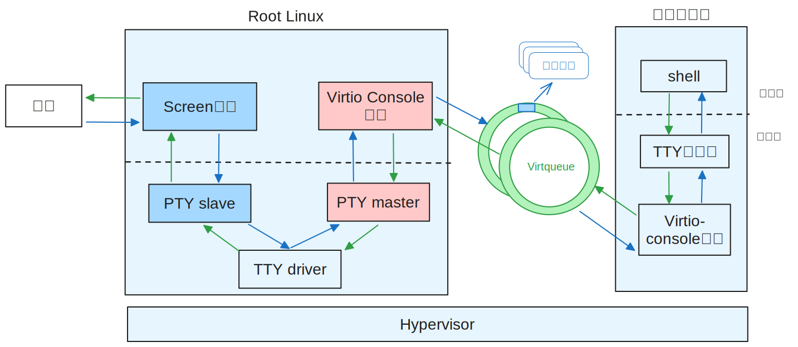

# Virtio Console

The Virtio Console device is essentially a virtual console device used for input and output of data and can be used as a virtual terminal for other virtual machines. Currently, hvisor supports the `VIRTIO_CONSOLE_F_SIZE` and `VIRTIO_F_VERSION_1` features.

## Description of the Virtio Console Device

For the Virtio console device, the type field in the VirtIODevice structure is VirtioTConsole, vqs_len is 2, indicating that there are two Virtqueues, the receive virtqueue and the transmit virtqueue, used for receiving and sending data for port 0. The dev pointer points to the virtio_console_dev structure that describes the specific information of the console device, in which the config represents the number of rows and columns of the console, master_fd is the file descriptor of the pseudo-terminal master device connected to the device, rx_ready indicates whether the receive queue is available, and event is used for the event monitor thread to monitor the readable events of the pseudo-terminal master device through epoll.

```c
typedef struct virtio_console_dev {
    ConsoleConfig config;
    int master_fd;
    int rx_ready;
    struct hvisor_event *event;
} ConsoleDev;
```

## Pseudo Terminal

A terminal is essentially an input-output device. When computers were first developed, terminals were called Teleprinters (TTY). Now, terminals have become a virtual device on computers, connected by terminal emulation programs to the graphics card driver and keyboard driver to implement data input and output. There are two different implementations of terminal emulation programs: the first is as a Linux kernel module, exposed to user programs as `/dev/tty[n]`; the second is as an application running in Linux user space, known as a pseudo-terminal (PTY).

Pseudo-terminals themselves are not the focus of this article, but the two devices used by pseudo-terminals that can pass data to each other—the PTY master and the PTY slave—are used in this article to implement the Virtio Console device.

Applications can obtain an available PTY master by executing `posix_openpt`, and can get the corresponding PTY slave for that PTY master using the `ptsname` function. A TTY driver connecting the PTY master and PTY slave will copy data between the master and slave. Thus, when a program writes data to the master (or slave), the program can read the same data from the slave (or master).

## Overall Design of the Virtio Console

The Virtio Console device acts as a daemon on Root Linux and opens a PTY master during device initialization, outputting the path of the corresponding PTY slave `/dev/pts/x` to the log file for screen session connections. Meanwhile, the event monitor thread in the Virtio daemon monitors the readable events of the PTY slave so that the PTY master can promptly obtain user input data.

When a user executes `screen /dev/pts/x` on Root Linux, a screen session is created on the current terminal, connecting to the device corresponding to the PTY slave `/dev/pts/x`, and taking over the input and output of the current terminal. The implementation structure of the Virtio Console device is shown in the figure below.



### Input Commands

When a user types commands on the keyboard, the input characters are passed to the Screen session through the terminal device. The Screen session writes the characters to the PTY slave. When the event monitor thread detects through epoll that the PTY slave is readable, it calls the `virtio_console_event_handler` function. This function reads from the PTY slave and writes the data into the Virtio Console device's Receive Virtqueue, and sends an interrupt to the corresponding virtual machine.

The corresponding virtual machine, after receiving the interrupt, passes the received character data through the TTY subsystem to the Shell for interpretation and execution.

### Display Information

When a virtual machine using the Virtio Console driver wants to output information through the Virtio Console device, the Virtio Console driver writes the data to be output into the Transmit Virtqueue and writes to the QueueNotify register in the MMIO area to notify the Virtio Console device to handle the IO operation.

The Virtio Console device reads from the Transmit Virtqueue, retrieves the data to be output, and writes it to the PTY master. The Screen session then retrieves the data to be output from the PTY slave and displays the output information on the monitor through the terminal device.

> Since the PTY master and PTY slave are connected by a TTY driver, which includes a line discipline for passing data written to the PTY slave back to the PTY master, we need to disable this functionality by using the `cfmakeraw` function to turn off the line discipline feature.