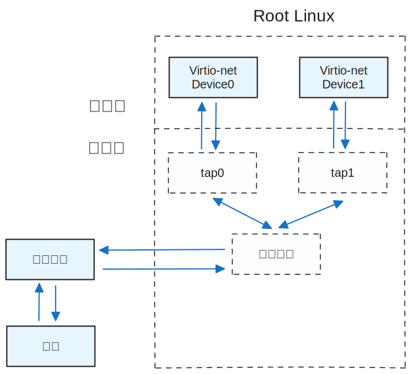

# Virtio Network Device

Virtio network device is essentially a virtual network card. Currently supported features include `VIRTIO_NET_F_MAC`, `VIRTIO_NET_F_STATUS`, `VIRTIO_F_VERSION_1`, `VIRTIO-RING_F_INDIRECT_DESC`, `VIRTIO_RING_F_EVENT_IDX`.

## Description of Virtio Network Device

For Virtio network devices, the type field in VirtIODevice is VirtioTNet, vqs_len is 2, indicating there are 2 Virtqueues, namely the Receive Queue and the Transmit Queue. The dev pointer points to the virtio_net_dev structure that describes specific information about the network device. In Virtio_net_dev, config is used to represent the MAC address and connection status of the network card, tapfd is the file descriptor for the Tap device corresponding to the device, rx_ready indicates whether the receive queue is available, and event is used for the receive packet thread to monitor the Tap device's readable events through epoll.

```c
typedef struct virtio_net_dev {
    NetConfig config;
    int tapfd;
    int rx_ready;   
    struct hvisor_event *event;
} NetDev;

struct hvisor_event {
    void		(*handler)(int, int, void *);
    void		*param;
    int			fd;
    int 		epoll_type;
};
```

## Tap Device and Bridge Device

The implementation of Virtio network devices is based on two types of virtual devices provided by the Linux kernel: Tap devices and bridge devices.

A Tap device is an Ethernet device implemented in software by the Linux kernel. Reading and writing to the Tap device in user space can simulate the reception and transmission of Ethernet frames. Specifically, when a process or kernel performs a write operation on the Tap device, it is equivalent to sending a packet to the Tap device. Performing a read operation on the Tap device is equivalent to receiving a packet from the Tap device. Thus, by reading and writing to the Tap device, packet transfer between the kernel and the process can be achieved.

The command to create a tap device is: `ip tuntap add dev tap0 mode tap`. This command creates a tap device named tap0. If a process wants to use this device, it needs to first open the /dev/net/tun device, obtain a file descriptor tun_fd, and call ioctl(TUNSETIFF) on it to link the process to the tap0 device. Afterward, tun_fd actually becomes the file descriptor for the tap0 device, and it can be read, written, and polled.

A bridge device is a virtual device provided by the Linux kernel that functions similarly to a switch. When other network devices are connected to a bridge device, those devices become ports of the bridge device, which takes over the packet sending and receiving process of all devices. When other devices receive packets, they are sent directly to the bridge device, which forwards them to other ports based on MAC addresses. Therefore, all devices connected to the bridge can communicate with each other.

The command to create a bridge device is: `brctl addbr br0`. The command to connect the physical network card eth0 to br0 is: `brctl addif br0 eth0`. The command to connect the tap0 device to br0 is: `brctl addif br0 tap0`.

Before the Virtio network device starts, Root Linux needs to create and start the tap device and bridge device in advance through the command line, and connect the tap device and Root Linux's physical network card to the bridge device, respectively. Each Virtio network device needs to connect to a tap device, ultimately forming a network topology as shown in the following diagram. In this way, the Virtio network device can transmit packets with the external network by reading and writing to the tap device.



## Sending Packets

The Transmit Virtqueue of the Virtio network device is used to store the send buffer. When the device receives a request from the driver to write to the QueueNotify register, if the QueueSel register points to the Transmit Queue at that time, it indicates that the driver has informed the device that there is a new packet to send. The Virtio-net device will take out a descriptor chain from the available ring, each descriptor chain corresponds to a packet, and the memory buffer it points to contains the packet data to be sent. The packet data includes 2 parts, the first part is the packet header virtio_net_hdr_v1 structure specified by the Virtio protocol, which contains some description information of the packet, and the second part is the Ethernet frame. To send a packet, only the Ethernet frame part needs to be written into the Tap device through the writev function. After the Tap device receives the frame, it will forward it to the bridge device, which will forward it to the external network through the physical network card based on the MAC address.

## Receiving Packets

When initializing, the Virtio network device adds the file descriptor of the Tap device to the interest list of the event monitor thread epoll instance. The event monitor thread will loop and call the epoll_wait function to monitor the readable events of the tap device. Once a readable event occurs, indicating that the tap device has received a packet from the kernel, the epoll_wait function returns and executes the packet reception processing function. The processing function will take out a descriptor chain from the available ring of the Receive Virtqueue and read from the tap device, writing the data into the memory buffer pointed to by the descriptor chain, and updating the used ring. The processing function will repeat this step until reading from the tap device returns a negative value and errno is EWOULDBLOCK, indicating that there are no new packets in the tap device, after which it will interrupt to notify other virtual machines to receive packets.

## Configuring the Environment

### Requirements for Disk Images

The disk image of root Linux needs to install at least the following packages:

```
apt-get install git sudo vim bash-completion \
kmod net-tools iputils-ping resolvconf ntpdate
```

### Requirements for the Linux Image

Before compiling the root Linux image, change the CONFIG_IPV6 and CONFIG_BRIDGE configs to y in the .config file to support creating bridge and tap devices in root Linux. For example:

```shell
cd linux
# Add a line in .config
CONFIG_BLK_DEV_RAM=y
# Modify two CONFIG parameters in .config
CONFIG_IPV6=y
CONFIG_BRIDGE=y
# Then compile Linux
```

### Creating a Network Topology

Before using Virtio net devices, you need to create a network topology in root Linux so that Virtio net devices can connect to real network cards through Tap devices and bridge devices. Execute the following commands in root Linux:

```shell
mount -t proc proc /proc
mount -t sysfs sysfs /sys
ip link set eth0 up
dhclient eth0
brctl addbr br0
brctl addif br0 eth0
ifconfig eth0 0
dhclient br0
ip tuntap add dev tap0 mode tap
brctl addif br0 tap0
ip link set dev tap0 up
```

This will create a `tap0 device <-> bridge device <-> real network card` network topology.

### Testing Non-root Linux Network Connectivity

Execute the following commands in the non-root Linux command line to start the network card:

```shell
mount -t proc proc /proc
mount -t sysfs sysfs /sys
ip link set eth0 up
dhclient eth0
```

You can test network connectivity with the following commands:

```
curl www.baidu.com
ping www.baidu.com
```