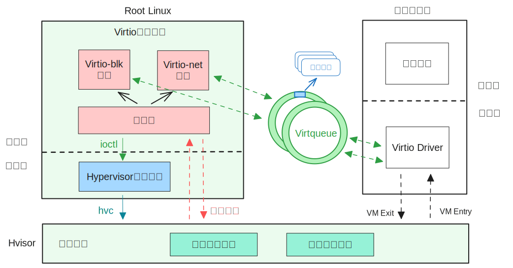

# Virtio

## Introduction to Virtio

Virtio, proposed by Rusty Russell in 2008, is a device virtualization standard aimed at improving device performance and unifying various semi-virtual device schemes. Currently, Virtio includes over a dozen peripherals such as disks, network cards, consoles, GPUs, etc., and many operating systems including Linux have implemented frontend drivers for various Virtio devices. Therefore, the virtual machine monitor only needs to implement the Virtio backend device, and it can directly allow virtual machines that have implemented Virtio drivers, such as Linux, to use Virtio devices.

The Virtio protocol defines a set of driver interfaces for semi-virtual IO devices, stipulating that the operating system of the virtual machine needs to implement the frontend driver, and the Hypervisor needs to implement the backend device. The virtual machine and Hypervisor communicate and interact through the data plane interface and control plane interface.

### Data Plane Interface

The data plane interface refers to the method of IO data transfer between the driver and the device. For Virtio, the data plane interface refers to a shared memory area between the driver and the device called Virtqueue. Virtqueue is an important data structure in the Virtio protocol, a mechanism and abstract representation for batch data transfer of Virtio devices, used for various data transfer operations between the driver and the device. Virtqueue consists of three main components: Descriptor Table, Available Ring, and Used Ring, which function as follows:

1. Descriptor Table: An array of descriptors. Each descriptor contains four fields: addr, len, flag, next. Descriptors can represent the address (addr), size (len), and attributes (flag) of a memory buffer, which may contain the command or data of an IO request (filled by the Virtio driver), or the result after the IO request is completed (filled by the Virtio device). Descriptors can be linked into a descriptor chain by the next field as needed, where a descriptor chain represents a complete IO request or result.

2. Available Ring: A circular queue, each element in the queue represents the index of the IO request issued by the Virtio driver in the descriptor table, pointing to the starting descriptor of a descriptor chain.
3. Used Ring: A circular queue, each element in the queue represents the index of the IO result written by the Virtio device in the descriptor table after completing the IO request.

Thus, using these three data structures, a complete description of the commands, data, and results for IO data transfer requests between the driver and the device can be made. The Virtio driver is responsible for allocating the memory area where the Virtqueue is located and writing its address into the corresponding MMIO control registers to inform the Virtio device. After obtaining the addresses of the three components, the device can perform IO transfer with the driver through the Virtqueue.

### Control Plane Interface

The control plane interface refers to the way the driver discovers, configures, and manages the device. In the Hypervisor, the control plane interface of Virtio mainly refers to the MMIO registers based on memory mapping. The operating system first detects the MMIO-based Virtio device through the device tree, and by reading and writing these memory-mapped control registers, it can negotiate, configure, and notify the device. Among the more important registers are:

* QueueSel: Used to select the current operating Virtqueue. A device may contain multiple Virtqueues, and the driver indicates which queue it is operating by writing this register.

* QueueDescLow, QueueDescHigh: Used to indicate the intermediate physical address IPA of the descriptor table. The driver writes these two 32-bit registers to inform the device of the 64-bit physical address of the descriptor table, used to establish shared memory.

* QueueDriverLow, QueueDriverHigh: Used to indicate the intermediate physical address IPA of the available ring.

* QueueDeviceLow, QueueDeviceHigh: Used to indicate the intermediate physical address IPA of the used ring.

* QueueNotify: When the driver writes this register, it indicates that there are new IO requests in the Virtqueue that need to be processed.

In addition to control registers, the MMIO memory area of each device also contains a device configuration space. For disk devices, the configuration space indicates the disk's capacity and block size; for network devices, it indicates the device's MAC address and connection status. For console devices, the configuration space provides console size information.

For the MMIO memory area of the Virtio device, the Hypervisor does not map the second-stage address translation for the virtual machine. When the driver reads and writes this area, a page fault exception occurs causing a VM Exit into the Hypervisor, and the Hypervisor can determine the register accessed by the driver based on the access address causing the page fault exception, and make the corresponding processing, such as notifying the device to perform IO operations. After processing, the Hypervisor returns to the virtual machine through VM Entry.

### IO Process of Virtio Devices

A user process running on a virtual machine, from issuing an IO operation to obtaining the IO result, can generally be divided into the following four steps:

1. The user process initiates an IO operation, the Virtio driver in the operating system kernel receives the IO operation command, writes it into the Virtqueue, and writes the QueueNotify register to notify the Virtio device.
2. After receiving the notification, the device parses the available ring and descriptor table to obtain the specific IO request and buffer address, and performs the actual IO operation.
3. After completing the IO operation, the device writes the result into the used ring. If the driver program uses the method of polling the used ring to wait for the IO result, the driver can immediately receive the result information; otherwise, it needs to notify the driver program through an interrupt.
4. The driver program obtains the IO result from the used ring and returns it to the user process.

## Design and Implementation of the Virtio Backend Mechanism

The Virtio devices in hvisor follow the [Virtio v1.2](https://docs.oasis-open.org/virtio/virtio/v1.2/virtio-v1.2.pdf) protocol for design and implementation. To maintain good device performance while ensuring the lightweight nature of hvisor, the two design points of the Virtio backend are:

1. Adopting the microkernel design philosophy, moving the implementation of Virtio devices from the Hypervisor layer to the management virtual machine user space. The management virtual machine runs the Linux operating system, known as Root Linux. Physical devices such as disks and network cards are directly passed through to Root Linux, while Virtio devices act as daemons on Root Linux, providing device emulation for other virtual machines (Non Root Linux). This ensures the lightweight nature of the Hypervisor layer and facilitates formal verification.

2. The Virtio drivers located on other virtual machines and the Virtio devices on Root Linux interact directly through shared memory. The shared memory area that stores interaction information is called a communication springboard and adopts the producer-consumer model, shared by the Virtio device backend and Hypervisor. This reduces the interaction overhead between the driver and the device, enhancing the device's performance.

Based on the above two design points, the implementation of the Virtio backend device will be divided into three parts: communication springboard, Virtio daemon, and kernel service module:



### Communication Springboard

To achieve efficient interaction between drivers and devices distributed across different virtual machines, this paper designs a communication springboard as a bridge for passing control plane interaction information between the driver and the device. It is essentially a shared memory area containing two circular queues: the request submission queue and the request result queue, which store interaction requests issued by the driver and results returned by the device, respectively. Both queues are located in the memory area shared by the Hypervisor and the Virtio daemon and adopt the producer-consumer model. The Hypervisor acts as the producer of the request submission queue and the consumer of the request result queue, while the Virtio daemon acts as the consumer of the request submission queue and the producer of the request result queue. This facilitates the transfer of Virtio control plane interaction information between Root Linux and other virtual machines. It should be noted that the request submission queue and request result queue are different from the Virtqueue. The Virtqueue is the data plane interface between the driver and the device, used for data transfer, and essentially contains information about the data buffer's address and structure. The communication springboard, on the other hand, is used for control plane interaction and communication between the driver and the device.

<div align=center></div>

* Communication Springboard Structure

The communication springboard is represented by the struct virtio_bridge, where req_list is the request submission queue, and res_list and cfg_values together form the request result queue. The device_req struct represents interaction requests sent by the driver to the device, and the device_res struct represents interrupt information to be injected by the device, used to notify the virtual machine driver that the IO operation has been completed.

```c
// Communication Springboard Structure:
struct virtio_bridge {
	__u32 req_front;
	__u32 req_rear;
    __u32 res_front;
    __u32 res_rear;
    // Request submission queue
	struct device_req req_list[MAX_REQ]; 
    // res_list, cfg_flags, and cfg_values together form the request result queue
    struct device_res res_list[MAX_REQ];
	__u64 cfg_flags[MAX_CPUS]; 
	__u64 cfg_values[MAX_CPUS];
	__u64 mmio_addrs[MAX_DEVS];
	__u8 mmio_avail;
	__u8 need_wakeup;
};
// Interaction requests sent by the driver to the device
struct device_req {
	__u64 src_cpu;
	__u64 address; // zone's ipa
	__u64 size;
	__u64 value;
	__u32 src_zone;
	__u8 is_write;
	__u8 need_interrupt;
	__u16 padding;
};
// Interrupt information to be injected by the device
struct device_res {
    __u32 target_zone;
    __u32 irq_id;
};
```

#### Request Submission Queue

The request submission queue is used for the driver to send control plane interaction requests to the device. When the driver reads and writes the MMIO memory area of the Virtio device, since the Hypervisor does not perform second-stage address mapping for this memory area in advance, the CPU executing the driver program will receive a page fault exception and fall into the Hypervisor. The Hypervisor will combine the current CPU number, the address of the page fault exception, the address width, the value to be written (ignored if it is a read), the virtual machine ID, whether it is a write operation, etc., into a structure called device_req, and add it to the request submission queue req_list. At this time, the Virtio daemon monitoring the request submission queue will retrieve and process the request.

To facilitate communication between the Virtio daemon and the Hypervisor based on shared memory, the request submission queue req_list is implemented as a circular queue. The head index req_front is updated only by the Virtio process after retrieving the request, and the tail index req_rear is updated only by the Hypervisor after adding the request. If the head and tail indices are equal, the queue is empty; if the tail index plus 1 modulo the head index is equal, the queue is full, and the driver needs to block in place when adding more requests, waiting for the queue to become available. To ensure that the Hypervisor and the Virtio process have real-time observation and mutual exclusion access to shared memory, the Hypervisor needs to perform a write memory barrier after adding a request to the queue, then update the tail index, ensuring that the Virtio process can correctly retrieve the request in the queue when observing the tail index update. After the Virtio daemon retrieves the request from the queue, it needs to perform a write memory barrier to ensure that the Hypervisor can immediately observe the update of the head index. By using this producer-consumer model and circular queue method, along with the necessary memory barriers, the mutual exclusion problem of shared memory under different privilege levels is solved. Since multiple virtual machines may have multiple CPUs simultaneously adding requests to the request submission queue, the CPU needs to first acquire a mutex lock before operating the request submission queue; however, only the main thread of the Virtio daemon operates the request submission queue, so no lock is needed. This solves the mutual exclusion problem of shared memory under the same privilege level.

#### Request Result Queue

When the Virtio daemon completes the processing of a request, it will put the related information into the request result queue and notify the driver program. To improve communication efficiency, based on the classification of Virtio interaction information, the request result queue is divided into two sub-queues:

* Data Plane Result Sub-queue

The data plane result queue, represented by the res_list structure, is used to store information for injecting interrupts. When the driver program writes to the Queue Notify register in the device memory area, it indicates that there is new data in the available ring, requiring the device to perform IO operations. Since IO operations take too long, Linux, to avoid unnecessary blocking and improve CPU utilization, requires the Hypervisor to submit the IO request to the device, and the CPU needs to immediately return from the Hypervisor to the virtual machine to perform other tasks. Therefore, after completing the IO operation and updating the used ring, the Virtio process will combine the device's interrupt number irq_id and the virtual machine ID of the device into a device_res structure, add it to the data plane result sub-queue res_list, and fall into the Hypervisor through ioctl and hvc. The data plane result queue res_list is similar to the request submission queue, being a circular queue. The queue length can be determined by the head index res_front and the tail index res_rear. The Hypervisor will retrieve all elements from res_list and add them to the interrupt injection table VIRTIO_IRQS. The interrupt injection table is a key-value pair collection based on a B-tree, where the key is the CPU number, and the value is an array. The first element of the array indicates the effective length of the array, and the subsequent elements indicate the interrupts to be injected into this CPU. To prevent multiple CPUs from simultaneously operating the interrupt injection table, the CPU needs to first acquire a global mutex lock to access the interrupt injection table. Through the interrupt injection table, the CPU can determine which interrupts need to be injected into itself based on its own CPU number. Subsequently, the Hypervisor will send IPI inter-core interrupts to these CPUs needing interrupt injection. The CPUs receiving the inter-core interrupts will traverse the interrupt injection table and inject interrupts into themselves. The diagram below describes the entire process, where the black solid triangle arrows represent operations executed by CPUs running other virtual machines, and the black ordinary arrows represent operations executed by CPUs running Root Linux.


* Control Plane Result Sub-queue

The control plane result queue, represented by the cfg_values and cfg_flags arrays, where the array index is the CPU number, i.e., each CPU uniquely corresponds to the same position in the two arrays. cfg_values is used to store the results of control plane interface interactions, and cfg_flags are used to indicate whether the device has completed the control plane interaction request. When the driver program reads and writes the registers in the device memory area (except the Queue Notify register), it sends out configuration and negotiation-related control plane interaction requests. After such an interaction request is added to the request submission queue, the CPU that fell into the Hypervisor due to the driver needs to wait for the result to return before it can return to the virtual machine. Since the Virtio daemon does not need to perform IO operations for this type of request, it only needs to query related information, so it can quickly complete the processing of the request and does not need to update the used ring. After completing the request, the daemon will write the result value into cfg_values[id] (for read requests) according to the driver's CPU number id, perform a write memory barrier, then increment cfg_flags[id], and perform a second write memory barrier to ensure that when the driver-side CPU observes changes in cfg_flags[id], cfg_values[id] has already saved the correct result value. When the driver-side CPU observes changes in cfg_flags[id], it can determine that the device has returned the result, directly retrieve the value from cfg_values[id], and return to the virtual machine. This allows the Virtio device to avoid executing ioctl and hvc, causing unnecessary CPU context switches, thereby enhancing the device's performance. The diagram below describes the entire process, where the black solid triangle arrows represent operations executed by CPUs running other virtual machines, and the black ordinary arrows represent operations executed by CPUs running Root Linux.


### Kernel Service Module

Since the Virtio daemon located in the Root Linux user space needs to communicate with hvisor, this paper uses the kernel module hvisor.ko in Root Linux as a bridge for communication. In addition to being used by command-line tools, this module also undertakes the following tasks:

1. Establishing the shared memory area where the communication springboard is located between the Virtio daemon and the Hypervisor during Virtio device initialization.

When the Virtio daemon initializes, it requests the kernel module to allocate the shared memory where the communication springboard is located through ioctl. At this time, the kernel module allocates a page of continuous physical memory as shared memory through the memory allocation function `__get_free_pages`, and sets the page attribute to the reserved state through the `SetPageReserved` function to avoid the page being swapped to disk due to Linux's page recycling mechanism. Subsequently, the kernel module needs to make this memory accessible to both the Virtio daemon and the Hypervisor. For the Hypervisor, the kernel module executes hvc to notify the Hypervisor and passes the physical address of the shared memory as a parameter. For the Virtio daemon, the process calls mmap on /dev/hvisor, and the kernel module maps the shared memory to a free virtual memory area of the Virtio process in the hvisor_map function. The starting address of this area is returned as the return value of mmap.

2. When the Virtio backend device needs to inject device interrupts into other virtual machines, it notifies the kernel module through ioctl, and the kernel module calls the system interface provided by the Hypervisor through the hvc command to notify the Hypervisor to perform the corresponding operations.

3. Waking up the Virtio daemon.

When the driver accesses the device's MMIO area, it falls into EL2 and enters the mmio_virtio_handler function. This function determines whether it needs to wake up the Virtio daemon based on the need_wakeup flag in the communication springboard. If the flag is 1, it sends an SGI interrupt with event id IPI_EVENT_WAKEUP_VIRTIO_DEVICE to Root Linux's CPU 0. CPU 0, upon receiving the SGI interrupt, falls into EL2 and injects the interrupt number of the hvisor_device node in the Root Linux device tree into itself. When CPU 0 returns to the virtual machine, it receives the injected interrupt and enters the interrupt handling function previously registered by the kernel service module. This function sends the SIGHVI signal to the Virtio daemon through the send_sig_info function. The Virtio daemon, previously blocked in the sig_wait function, receives the SIGHVI signal, polls the request submission queue, and sets the need_wakeup flag to 0.

### Virtio Daemon

To ensure the lightweight nature of the Hypervisor, this paper